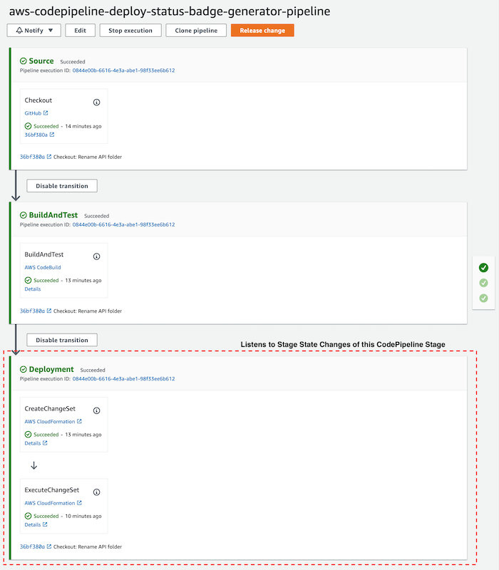

# aws-codepipeline-deploy-status-badge-generator

[](https://eu-central-1.console.aws.amazon.com/codesuite/codepipeline/pipelines/aws-codepipeline-deploy-status-badge-generator-pipeline/view?region=eu-west-2)
[]( https://0zroxzsyj3.execute-api.eu-west-2.amazonaws.com/Stage//pipeline/aws-codepipeline-deploy-status-badge-generator-pipeline/commit/url)


Infamously AWS CodePipeline doesn't offer you any way of retrieving the deployment status of your pipeline in the shape of status badge that you can add to your `README.md` file.

>'What's the point of having a pipeline then?' - you might ask and rightfully so!

This little project spins up a NodeJS 12 serverless application within AWS, that subscribes to all CodePipeline CloudWatch events that all AWS CodePipelines automatically publish. It analyses the event's state and content and if the pipeline stage's name contains the word "deploy", it will fetch any repository meta data and update the deployment status in a DynamoDB table.
This information can then be used to obtain GitHub badges via the provisioned REST API.

Yes, it sounds way too complex for such a simple task. But it comes with a handful of nice advantages:

* Once setup it supports as many CodePipeline pipelines as you have. No further configuration required.
* Badges are served with correct cache settings that is respected by GitHub. So you'll always see the most-recent deployment status.
* Depending on the deployment status, the badge will correctly display if the pipeline is currently running, has completely successfully or has failed.
* Badge generation (powered by [badgen](https://github.com/badgen/badgen)), which gives you simple and precise SVGs
* Possibility to relabel badge's pipeline name via URL query parameter.
* Any heavy lifting is done by AWS SAM / CloudFormation. Just sit back in relax.

## Usage

### Preqrequisites

Having any number of CodePipelines like this one:


1. `Source` stage that is connected to VCS so we can fetch the commit ID from the stage's meta data
    * **Note:** Currently this stage needs to have the the work `source` in its name (case-insensitive), so the generator recognises it correctly
1. `Deploy` stage that deploys your application, i.e. if the stage has been successfully completed it means that your app has been successfully deployed.
    * **Note:** Currently this stage needs to have the the work `deploy` in its name (case-insensitive), so the generator recognises it correctly

**Note**: The generator doesn't care about any other stages, so feel free to have as many in any constelation as you like.

### Fetch Badges

After you've triggered one of your pipelines you can get your badges via below endpoints:

**Note**: You will need to adjust the URL with the URL of your deployment's API Gateway

| Badge Name | Description | Example   |
|---|---|---|
| `GET /pipeline/{pipelineName}/status` | Deployment status of pipeline   |  |
| `GET /pipeline/{pipelineName}/status?label=🦦%20Badge%20Generator` | Deployment status of pipeline with alternative label  |  |
| `GET /pipeline/{pipelinaName}/id`  | Short SHA-1 hash of last successfully deployed commit of pipeline |  |
| `GET /pipeline/{pipelinaName}/id?label=🦦%20Badge%20Generator`  | Short SHA-1 hash of last successfully deployed commit of pipeline with alternative label |  |
| `GET /pipeline/{pipelinaName}/url` | Redirect link to GitHub commit of last deployed commit | [GitHub direct link to last deployed commit]( https://0zroxzsyj3.execute-api.eu-west-2.amazonaws.com/Stage//pipeline/aws-codepipeline-deploy-status-badge-generator-pipeline/commit/url) |
| `POST /pipeline/{pipelinaName}` | Update deployment status (requires API key) | `curl -d '{"status": "SUCCEEDED", "deployedCommitId": "123", "deployedCommitUrl": "https://commit.url"}' -H 'X-API-Key:123-123-123-123'  https://0zroxzsyj3.execute-api.eu-west-2.amazonaws.com/Stage//pipeline/test-pipeline` |

**Note**: You will have to manually set up the API key within AWS API Gateway for the POST endpoint if you would like to use it.

## Deployment

This project uses the AWS Serverless Application Model (SAM) to provision all required resources. (see `template.yml`). 

**Requirements:** To deploy this to your stack, you will need to install the [AWS SAM CLI](https://aws.amazon.com/serverless/sam/)

```bash
# Clone this repo and change directories into it
git clone https://github.com/hmmmsausages/aws-codepipeline-deploy-status-badge-generator
cd aws-codepipeline-deploy-status-badge-generator
# Build SAM project
sam build
# Start deployment of app. The SAM wizard will guide you through it
sam deploy --guided
```

After the deployment your AWS account is left with:

* `aws-codepipeline-deploy-status-badge-generator-api` - Lambda that generates and serves badges and meta information
* `aws-codepipeline-deploy-status-badge` - API Gateway that routes HTTP(S) requests to above Lambda.
  * **Note**: You'll get your API URL from here. If you like you can add a custom domain manually as well.
* `aws-codepipeline-deploy-status-badge-generator-update` - Lambda that listens to CodePipeline CloudWatch Events to update deployment information in DynamoDB
* `aws-codepipeline-deploy-status-badge` - CloudWatch EventBridge Rule to trigger above Lambda on CodePipeline state change events
* `CodePipelineDeploymentInformation` - DynamoDB table that stores deployment information, like pipeline name, pipeline url, commit hash, and deployment status

## Contribute

Please feel free to contribute and raise pull-requests

## License

MIT License
Copyright (c) 2020 Andre Mueller

see also [LICENSE.md](./LICENSE.md)
 